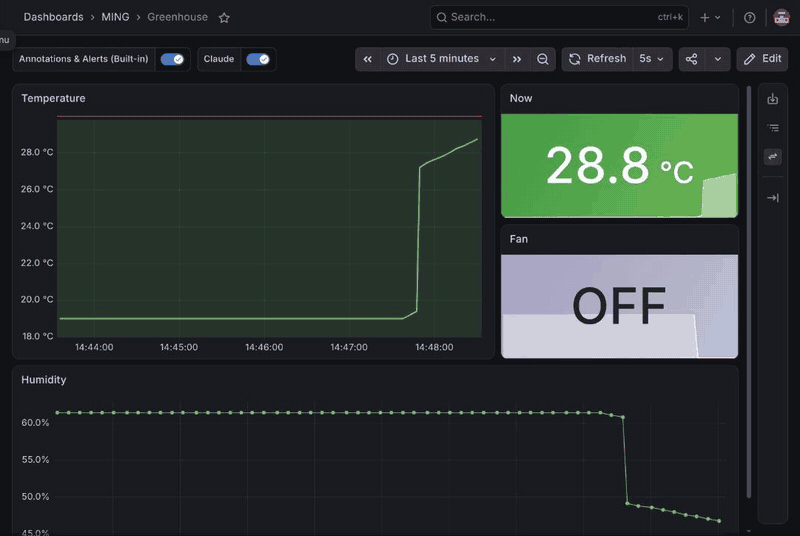

# MING stack example

Already running your own broker, InfluxDB, Node-RED or Grafana? Follow
[`docs/ming-tutorial.md`](../../docs/ming-tutorial.md) instead.

Mosquitto, InfluxDB 2, Node-RED and Grafana, set up the way the plugin's MING
tools expect: TLS everywhere, no anonymous access, and credentials for Claude
that can do only what the plugin allows.

| Service | Port | Claude's credential | What it can do |
| --- | --- | --- | --- |
| Mosquitto 2.0.22 | 8883 (TLS) | user `claude` | read `sensors/#`, read and write `actuators/#` (ACL) |
| InfluxDB 2.9.1 | 8086 (HTTPS) | scoped token | read `sensors` and `claude`, write `claude` |
| Node-RED 5.0.7 | 1880 (HTTPS) | static API token | read flows, press inject buttons; **cannot deploy** |
| Grafana 13.2.2 | 3000 (HTTPS) | service account | Viewer; Editor with `MING_GRAFANA_ANNOTATE=1` |

The plugin narrows this further: `config.toml` names the exact topics, buckets
and inject nodes, and every write needs `confirm=true`.

## Run it

Needs Docker Engine with the compose plugin, `openssl`, `curl`, `python3` and
`setfacl` (package `acl`), and a user in the `docker` group.

```bash
# On the Omarchy machine itself: everything on 127.0.0.1.
MING_CLIENT_DIR=~/.config/omarchy-hardware/ming ./bootstrap.sh

# On a Pi, reachable from the Omarchy machine as pi.local:
MING_BIND=0.0.0.0 MING_HOSTNAMES="pi.local 192.168.1.20" ./bootstrap.sh
```

`bootstrap.sh` makes a private CA and a server certificate, random passwords and
tokens under `secrets/` (mode 700), hashes the Mosquitto passwords, starts the
services, creates the scoped InfluxDB tokens and the Grafana service account,
and writes `client/`: the CA certificate, Claude's four credentials, and
`ming.toml`, the block to append to `~/.config/omarchy-hardware/config.toml`.
Re-running it keeps everything that already exists.

For a remote stack, copy `client/` to `~/.config/omarchy-hardware/ming` on the
Omarchy machine (directory mode 700, files 600), append `client/ming.toml` to
`config.toml`, then ask Claude to run `ming_status`.

Devices publish as user `device` (password in `secrets/mqtt-device-password`)
to `sensors/...` over TLS with `certs/ca.crt`. Add more users with
`mosquitto_passwd` and the ACL in `mosquitto/acl`.

## Arduino Uno tutorial

Follow the [step-by-step Arduino tutorial](arduino) to send diagnostic values
through a physical Uno, MQTT/TLS, Node-RED and InfluxDB into a Grafana results
dashboard. It includes a reusable check script, recorded passing and failed
evidence, and the existing flow's second-resolution sampling limitation.
The values are serial echoes, not sensor measurements.

## Greenhouse demo

[`demo/`](demo) adds a simulated greenhouse, a Node-RED bridge into InfluxDB, a
Grafana dashboard and Omarchy notifications, then walks through Claude cooling
the greenhouse down with the plugin's tools:



```bash
./demo/setup.sh --annotate
./demo/omarchy-demo.sh --trust-ca
```

## Security notes

- The containers read their keys through file ACLs (`setfacl`) granted to the
  image users (Mosquitto 1883, InfluxDB and Node-RED 1000, Grafana 472), so
  nothing under `secrets/` or `certs/server.key` is world-readable. Rootless
  Docker or user-namespace remapping changes those IDs; adjust `bootstrap.sh`.
- The CA key stays in `certs/ca.key`. Anyone holding it can impersonate these
  services to the plugin; keep the directory private, or delete the key once
  the certificates are issued (re-issuing then needs a new CA). The CA is
  name-constrained to localhost, 127.0.0.0/8, the service names and the
  `MING_HOSTNAMES` you gave, so even a leaked key cannot mint a certificate for
  any other site. That is what makes `demo/omarchy-demo.sh --trust-ca` safe.
  Certificates from before this change have no constraints; delete `certs/` and
  re-run `bootstrap.sh` to re-issue them.
- Ports bind to 127.0.0.1 unless `MING_BIND` says otherwise. Exposing the stack
  beyond a trusted LAN is not what this example is for.
- The InfluxDB admin token in `secrets/influxdb-admin-token` is full access.
  Claude never gets it.

## The services' own MCP servers

Checked on 2026-09-18 against this stack, each given only Claude's scoped
credential from `client/`:

| Service | MCP server | Result |
| --- | --- | --- |
| Grafana | [grafana/mcp-grafana](https://github.com/grafana/mcp-grafana) (official) | Works over TLS (`-tls-ca-file`). 81 tools, including a raw `grafana_api_request`; with the Viewer account every write (dashboard update, delete, annotation, plugin install) is refused by Grafana. |
| InfluxDB 2 | [idoru/influxdb-mcp-server](https://github.com/idoru/influxdb-mcp-server) 0.2.0 (community; InfluxData's own targets InfluxDB 3) | Works with `NODE_EXTRA_CA_CERTS`. Takes raw Flux; the scoped token blocks writes to `sensors` (also through `to()`) and org creation, but it writes to `claude` with no confirmation. |
| Node-RED | [karavaev-evgeniy/node-red-mcp-server](https://github.com/karavaev-evgeniy/node-red-mcp-server) 1.0.2 (community, archived) | Works with `NODE_EXTRA_CA_CERTS`. 20 tools including flow deploy and delete; Claude's token (`read` + `inject.write`) makes Node-RED refuse all of them (401). It can press *any* inject node. |
| Mosquitto | none official; [ezhuk/mqtt-mcp](https://github.com/ezhuk/mqtt-mcp) (community) | Not run: no TLS support, and it takes broker host and credentials as tool arguments. |

If you add any of them next to this plugin, the credential you give it is the
only thing limiting it: no allowlist, confirmation, rate limit or audit record.

## Status

Brought up end to end on 2026-09-18 (x86_64, Docker 29.7.2), with all ten
plugin tools driven over MCP stdio against it. Checked on the service side as
well: with Claude's own credentials, Node-RED refuses a flow deploy (401),
InfluxDB refuses a write to `sensors` (403), Grafana refuses an annotation from
the Viewer account (403), and Mosquitto drops a publish outside the ACL.
Re-running `bootstrap.sh` keeps every credential, and re-issuing certificates
restarts the running services. The greenhouse demo was run the same day, from
"too hot" notification to annotated cool-down. Not yet run on a Pi.

Known noise: Mosquitto 2.0.22 warns that `passwd` and `acl` are not owned by its
own user and that future versions will refuse them. Bind mounts cannot change
ownership without root, so an image upgrade past 2.0.x needs a different way of
providing those two files. Grafana logs errors for the provisioning folders
this example does not use (plugins, alerting, dashboards); they are harmless.
